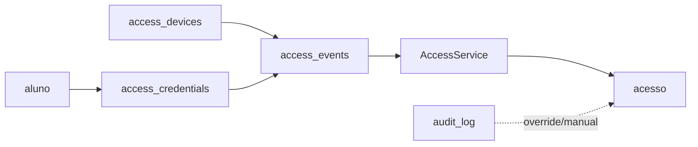
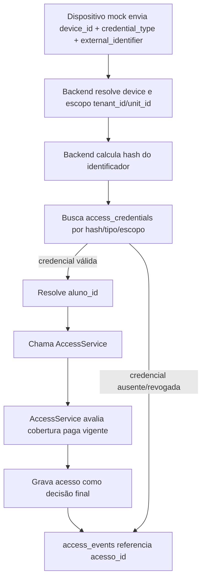
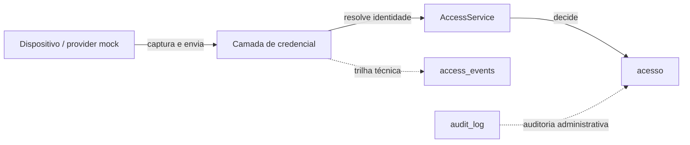

# Access Device Platform — Arquitetura

## Princípio

```txt
Dispositivo identifica
Backend decide
Atuador executa
Sistema registra
```

O hardware não deve conter a regra de negócio crítica.

## Universalização correta

Não se universaliza o protocolo bruto dos dispositivos.

Cada fabricante pode usar:

- HTTP
- TCP/IP
- serial
- USB
- SDK local
- polling
- webhook
- payload JSON
- payload texto
- payload binário

O que o sistema universaliza é o contrato interno:

```txt
raw payload externo
↓
Provider Adapter
↓
AccessIdentificationEvent
↓
CredentialResolver
↓
AccessService
↓
DeviceCommand
↓
Provider/Transport Adapter
```

## Contratos principais

### AccessIdentificationEvent

```ts
type AccessIdentificationEvent = {
  provider: string;
  deviceId: string;
  unitId?: string;
  method: 'face' | 'fingerprint' | 'card' | 'pin' | 'qrcode' | 'manual';
  externalIdentifier: string;
  occurredAt: string;
  rawPayloadRef?: string;
  metadata?: Record<string, unknown>;
};
```

### AccessDecision

```ts
type AccessDecision = {
  allowed: boolean;
  reasonCode:
    | 'ALLOWED'
    | 'ALLOWED_MANUAL_OVERRIDE'
    | 'BLOCKED_INACTIVE'
    | 'BLOCKED_NO_ACTIVE_SUBSCRIPTION'
    | 'BLOCKED_OVERDUE'
    | 'BLOCKED_MANUAL'
    | 'BLOCKED_PENDING'
    | 'BLOCKED_UNIT_SCOPE'
    | 'BLOCKED_UNKNOWN_CREDENTIAL'
    | 'BLOCKED_ERROR';
  reasonMessage: string;
  alunoId?: number;
  credentialId?: number;
  overrideId?: number;
};
```

### DeviceCommand

```ts
type DeviceCommand =
  | {
      type: 'OPEN_TURNSTILE';
      deviceId: string;
      reason: string;
    }
  | {
      type: 'DENY_ACCESS';
      deviceId: string;
      message: string;
    }
  | {
      type: 'SYNC_CREDENTIAL';
      deviceId: string;
      credentialId: string;
    };
```

## Provider Adapter

Provider conhece protocolo de fabricante.

Exemplos:

- SimulatorProvider
- ControlIdProvider
- TopdataProvider
- HenryProvider
- IntelbrasProvider

## Transport Adapter

Transport conhece meio de comunicação.

Exemplos:

- HTTP
- TCP socket
- Serial COM
- USB/SDK
- WebSocket
- Polling

## Regra de ouro

```txt
Provider conhece protocolo.
Domínio conhece regra de negócio.
Repository conhece banco.
UseCase orquestra.
```

## MVP mínimo atual

Este eixo deve começar de forma incremental e mockada.

Separação mínima de responsabilidades:

- `access_devices`: cadastro lógico de dispositivo/terminal.
- `access_credentials`: vínculo entre aluno e credencial.
- `access_events`: evento técnico recebido do dispositivo/mock.
- `acesso`: registro canônico da decisão operacional final.
- `audit_log`: auditoria administrativa e override manual.

Regra principal do MVP:

- `AccessService` continua como autoridade final de decisão.
- dispositivo apenas envia credencial/evento.
- dispositivo nunca libera acesso sozinho.
- toda tentativa continua respeitando cobertura paga vigente, bloqueio de `em_aberto`/`parcial` e override manual auditado.

### Tipos mock iniciais

Credenciais:

- `card_mock`
- `pin_mock`
- `face_mock_ref`
- `biometric_mock_ref`

Dispositivos:

- `mock_terminal`
- `catraca_mock`
- `camera_mock`

### Status sugeridos

Credencial:

- `ativo`
- `revogado`
- `bloqueado`
- `pendente_enrollment`

Dispositivo:

- `ativo`
- `inativo`
- `bloqueado`
- `offline`
- `deprecated`

Evento:

- `recebido`
- `resolvido`
- `negado`
- `erro_resolucao`
- `erro_processamento`

## Contrato mínimo de credenciais/dispositivos

Checkpoint atual:

- o schema mínimo já foi criado em `backend/database/ensureSchema.js`
- `access_devices`, `access_credentials` e `access_events` já existem no SQLite local
- as três tabelas permanecem vazias neste checkpoint
- `AccessService` não foi alterado
- `acesso` continua sendo o registro canônico da decisão operacional final
- `audit_log` continua sendo a trilha administrativa e de override manual
- `access_events` já existe no schema, mas ainda não possui uso funcional no runtime atual

### access_devices

- `id`
- `tenant_id`
- `unit_id`
- `nome`
- `provider`
- `tipo`
- `external_device_id`
- `serial`
- `status`
- `last_seen_at`
- `metadata_json`
- `created_at`
- `updated_at`
- `deleted_at`

### access_credentials

- `id`
- `tenant_id`
- `unit_id`
- `aluno_id`
- `tipo`
- `identificador_hash`
- `provider`
- `external_credential_id`
- `status`
- `enrolled_at`
- `revoked_at`
- `metadata_json`
- `created_at`
- `updated_at`
- `deleted_at`

### access_events

- `id`
- `tenant_id`
- `unit_id`
- `device_id`
- `credential_id`
- `provider`
- `credential_type`
- `external_identifier_masked`
- `correlation_id`
- `raw_payload_ref`
- `received_at`
- `decision_status`
- `decision_reason`
- `acesso_id`
- `metadata_json`

## Diagramas Mermaid

### Entidades e tabelas atuais



### Fluxo futuro por credencial mock



### Fronteiras e responsabilidades



## Fluxo mínimo por credencial mock

1. Dispositivo mock envia `device_id`, `credential_type` e `external_identifier`.
2. Backend resolve `tenant_id` e `unit_id` a partir do dispositivo.
3. Backend procura a credencial por hash, tipo e escopo.
4. Se a credencial estiver ausente, bloqueada ou revogada, registra `access_event` negado.
5. Se a credencial for válida, resolve `aluno_id`.
6. Backend chama `AccessService`.
7. `AccessService` decide a liberação final com base na cobertura paga vigente e demais regras atuais.
8. Resultado final é gravado em `acesso`.
9. `access_event` referencia `acesso_id` quando houver decisão final registrada.
10. Override manual continua separado e auditado em `audit_log`.

## Evoluções futuras

As tabelas `access_devices`, `access_credentials` e `access_events` já existem no schema mínimo. Os itens abaixo representam expansão futura de capacidades, não pré-requisito para o MVP mockado.

### access_devices

- id
- unit_id
- provider
- model
- device_type
- communication_type
- identifier
- status
- capabilities_json
- config_json
- last_seen_at

### access_credentials

- id
- aluno_id
- unit_id
- credential_type
- provider
- external_identifier
- template_ref
- template_hash
- status
- metadata_json

### access_events

- id
- correlation_id
- tenant_id
- unit_id
- device_id
- credential_id
- provider
- credential_type
- external_identifier_masked
- raw_payload_ref
- received_at
- decision_status
- decision_reason
- acesso_id
- metadata_json

## Sem hardware real

Antes de integrar dispositivo físico:

1. criar contrato
2. criar modelo persistente
3. criar provider simulator
4. criar facial webcam mock
5. criar cartão/PIN mock
6. validar fluxo completo
7. depois integrar 1 provider real

## Segurança/LGPD

Biometria e face são dados sensíveis.

Diretrizes:

- evitar armazenar imagem bruta sem necessidade
- não armazenar template biométrico bruto neste estágio
- preferir hash, referência ou ID externo
- permitir revogação de credencial
- auditar enrollment/revogação
- proteger payload sensível
- hashear/redigir payload bruto
- segregar por tenant/unidade

## Fora do MVP

- reconhecimento facial real
- armazenamento de foto
- armazenamento de template biométrico bruto
- integração real Hikvision, ControlID, Topdata, Henry ou Intelbras
- gateway Electron
- fila offline
- sync multi-dispositivo
- anti-passback
- criptografia avançada de template
- enrollment biométrico real
- consentimento LGPD completo operacionalizado

## Riscos do MVP

- LGPD e dado sensível tratado cedo demais
- biometria bruta ou imagem facial persistida sem necessidade
- credencial sem `tenant_id` e `unit_id`
- dispositivo sem identidade confiável
- evento duplicado sem correlação/idempotência
- bypass do `AccessService`
- confundir o `mock-hikvision` atual com integração real de hardware

## Pontos de atenção pós-schema

- `updated_at` nas novas tabelas não possui trigger automática neste estágio
- foreign keys foram declaradas, mas o comportamento efetivo continua dependente do runtime SQLite atual
- `access_events` existe no schema, mas ainda não é usado por service, rota ou UI
- `correlation_id` é obrigatório e deverá ser gerado pelo service futuro
- os unique parciais já existem e precisam ser respeitados pelos services futuros
- não armazenar foto, imagem facial, biometria bruta ou template biométrico bruto
- `AccessService` não pode ser bypassado por dispositivo, provider ou mock
- `acesso` continua sendo a decisão operacional final; `access_events` é trilha técnica
